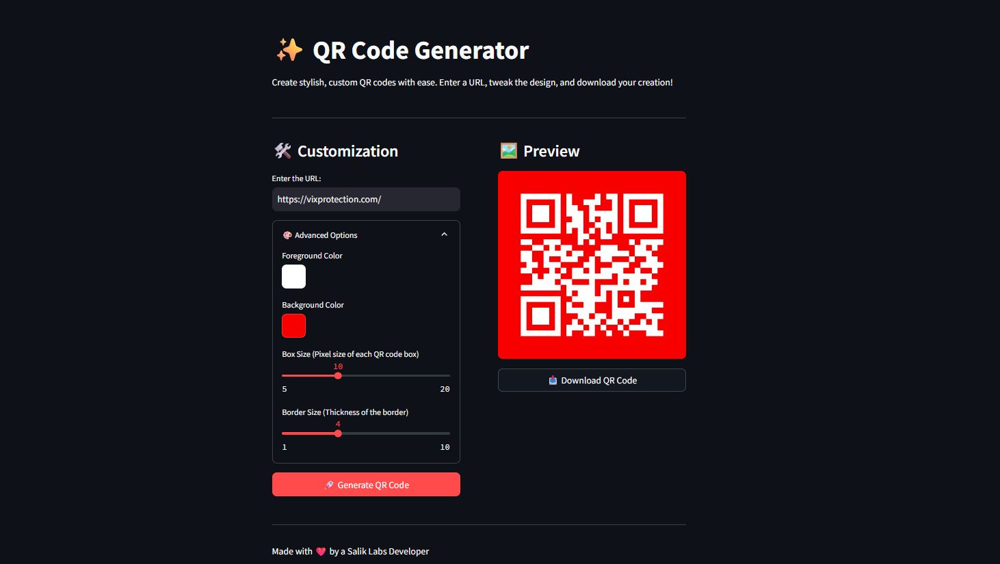

# ✨ Stylish QR Code Generator ✨

A user-friendly web application built with Streamlit that allows you to create, customize, and download QR codes in real-time. Go beyond boring black-and-white squares and design QR codes that match your style!

### 🔗 Live Demo

[**>> Click here to try the app live! <<**](https://your-app-link.streamlit.app/)

_(Instructions on how to get this link are in the 'Deployment' section below)_

### 🚀 Features

- **Instant QR Code Generation**: Enter any URL and get a QR code instantly.

- **Live Preview**: See your QR code update in real-time as you tweak the settings.

- **🎨 Advanced Customization**:

  - **Color Picker**: Choose custom foreground (dot) and background colors.

  - **Box Size**: Control the pixel size of each module in the QR code for higher or lower resolution.

  - **Border Control**: Adjust the thickness of the white space (quiet zone) around the QR code.

- **📥 One-Click Download**: Download your final creation as a high-quality PNG file with a sensible filename.

- **Sleek & Responsive UI**: A clean, modern interface that works beautifully on both desktop and mobile devices.

- **Stateful Design**: Uses Streamlit's session state to remember your design even if you interact with other parts of the app.

### 📸 Screenshot



### 🛠️ Tech Stack

- **Framework**: [Streamlit](https://streamlit.io/) - For building and deploying the web application.

- **QR Code Logic**: [qrcode](https://pypi.org/project/qrcode/) - The core library for generating the QR codes.

- **Image Handling**: [Pillow (PIL)](https://pypi.org/project/Pillow/) - For processing and handling the generated image data.

- **Language**: Python 3

### ⚙️ Installation & How to Run Locally

To run this application on your local machine, follow these simple steps.

**1. Clone the repository (or download the source code):**

```
git clone [https://github.com/your-username/your-repo-name.git](https://github.com/your-username/your-repo-name.git)
cd your-repo-name

```

**2. Create a virtual environment (Recommended):**

```
# For Windows
python -m venv venv
.\venv\Scripts\activate

# For macOS/Linux
python3 -m venv venv
source venv/bin/activate

```

**3. Install the required libraries:**
Create a file named `requirements.txt` and add the following lines:

```
streamlit
qrcode
Pillow

```

Then, run this command in your terminal:

```
pip install -r requirements.txt

```

**4. Run the Streamlit app:**
Once the dependencies are installed, run the following command:

```
streamlit run app.py

```

Your web browser should automatically open with the application running!

### ☁️ Deployment (How to get your app link)

You can deploy this app for **free** using [Streamlit Community Cloud](https://streamlit.io/cloud).

1. **Push your code to GitHub**: Your app's code (the `.py` file) and the `requirements.txt` file must be in a public GitHub repository.

2. **Sign up for Streamlit Community Cloud**: Go to [streamlit.io/cloud](https://streamlit.io/cloud) and sign up with your GitHub account.

3. **Deploy**: Click the "New app" button, select your repository, and deploy.

Streamlit will provide you with a URL (e.g., `https://your-app-name.streamlit.app`). You can then **replace the placeholder link at the top of this README** with your live app link!
